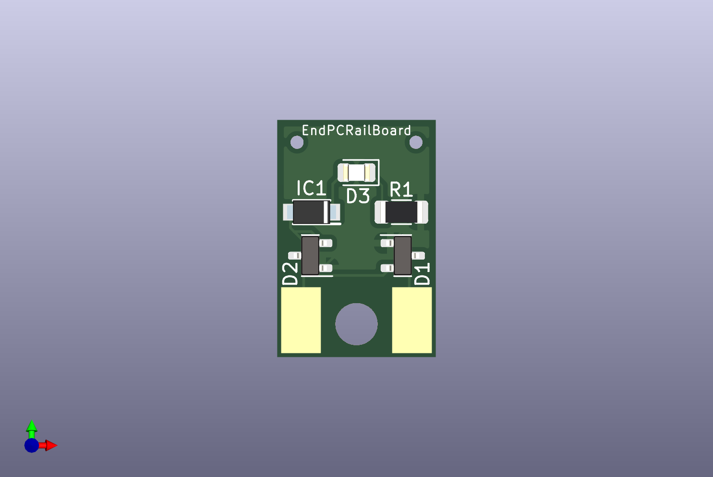

# KiCad-EndPCRailBoard

KiCad6 project files for EndPCRailBoard

## Description

This repositorhy contains KiCad6 project files for EndPCRailBoard.

EndPCRailBoard is designed for TOMIX N-gauge End PC Rail (Dummy type), which doesn't come with a circuit board to light it up.
The board size is the same as the original board which is included in End PC Rail (LED Type).

### Artifacts

- [Schematic](./artifacts/EndPCRailBoard-schematic.pdf)
- [BOM](https://htmlview.glitch.me/?https://github.com/kgh02017/KiCad-EndPCRailBoard/blob/main/project/EndPCRailBoard/bom/EndPCRailBoard.html)

## Arthor

Taku Izumi
